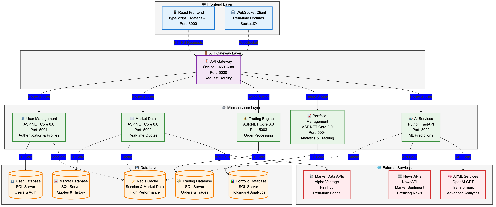
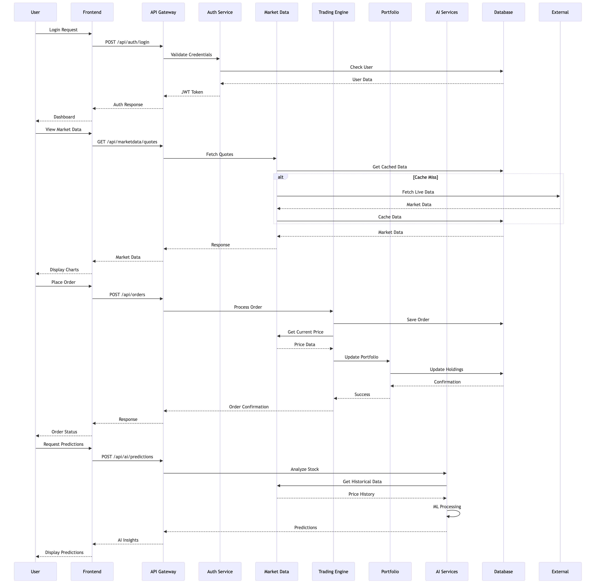
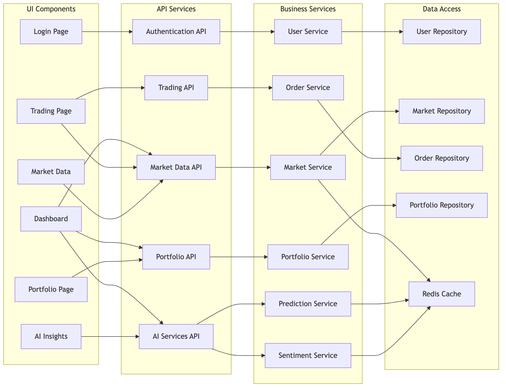
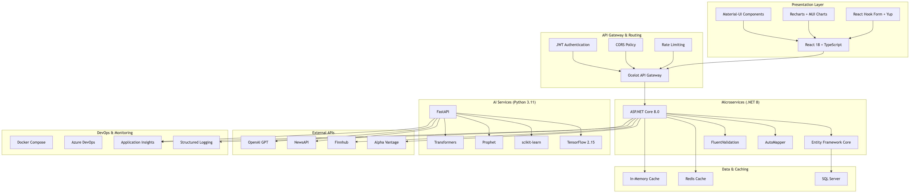

# Modern Stock Trading Platform

A comprehensive, enterprise-grade stock trading web application built with ASP.NET Core microservices, Python AI services, and React.js frontend, designed for scalability and performance.

## 🎯 Architecture Overview

### System Architecture


The platform follows a microservices architecture with:
- **Frontend Layer**: React SPA with real-time WebSocket connections
- **API Gateway**: Ocelot-based routing with JWT authentication
- **Microservices**: 5 independent .NET Core services + Python AI services
- **Data Layer**: SQL Server databases with Redis caching
- **External Integration**: Market data providers and AI/ML services

### Data Flow


Key data flows include:
1. **Authentication**: JWT-based login with token refresh
2. **Market Data**: Real-time quotes with caching strategy
3. **Trading**: Order placement with portfolio updates
4. **AI Insights**: ML-powered predictions and analysis

### Component Interaction


Components are organized in layers:
- **Presentation**: React components and pages
- **API**: RESTful endpoints with OpenAPI documentation
- **Business Logic**: Service layer with domain logic
- **Data Access**: Repository pattern with EF Core

### Technology Stack


Modern technology choices:
- **Frontend**: React 18 + TypeScript + Material-UI
- **Backend**: .NET 8 + Entity Framework + Ocelot
- **AI/ML**: Python 3.11 + FastAPI + TensorFlow
- **Data**: SQL Server + Redis + External APIs
- **DevOps**: Docker + Azure DevOps + Application Insights

## Tech Stack

### Backend
- **ASP.NET Core 8.0** - Microservices architecture
- **Entity Framework Core** - Data access layer
- **SignalR** - Real-time communication
- **JWT Authentication** - Secure API access
- **Swagger/OpenAPI** - API documentation

### AI & Analytics
- **Python 3.11+** with latest AI tools:
  - **TensorFlow/Keras** - Deep learning models
  - **scikit-learn** - Machine learning algorithms
  - **pandas & numpy** - Data manipulation
  - **yfinance** - Market data fetching
  - **TA-Lib** - Technical analysis
  - **Prophet** - Time series forecasting
  - **OpenAI GPT** - Natural language processing
  - **Streamlit** - AI dashboard

### Frontend
- **React 18** with TypeScript
- **Material-UI (MUI)** - Modern UI components
- **Redux Toolkit** - State management
- **React Query** - Server state management
- **Chart.js/TradingView** - Financial charts
- **Socket.io-client** - Real-time updates

### Cloud & Infrastructure
- **Azure App Service** - Hosting
- **Azure SQL Database** - Primary database
- **Azure Redis Cache** - Caching layer
- **Azure Key Vault** - Secrets management
- **Azure Application Insights** - Monitoring

## Architecture

### Microservices
1. **API Gateway** (Port 5000) - Request routing and authentication
2. **User Management Service** (Port 5001) - User accounts, profiles, authentication
3. **Market Data Service** (Port 5002) - Real-time market data, historical data
4. **Trading Engine Service** (Port 5003) - Order processing, trade execution
5. **Portfolio Service** (Port 5004) - Portfolio management, performance tracking
6. **AI Analytics Service** (Port 8000) - Python-based AI predictions and insights

### Frontend Application
- **React App** (Port 3000) - Modern trading dashboard

## Features

### Core Trading Features
- Real-time market data and charts
- Buy/sell order placement
- Portfolio management and tracking
- Trade history and analytics
- Watchlists and alerts

### AI-Powered Features
- Price prediction models
- Trading signal generation
- Risk assessment
- Market sentiment analysis
- Automated trading strategies
- Portfolio optimization recommendations

### User Experience
- Real-time dashboard updates
- Interactive financial charts
- Mobile-responsive design
- Dark/light theme support
- Advanced filtering and search

## Getting Started

### Prerequisites
- .NET 8.0 SDK
- Node.js 18+
- Python 3.11+
- SQL Server or Azure SQL Database
- Redis (optional, for caching)

### Installation

1. **Clone the repository**
   ```bash
   git clone https://github.com/debdevops/stocktrading.git
   cd stocktrading
   ```

2. **Backend Setup**
   ```bash
   # Restore NuGet packages for all microservices
   dotnet restore
   ```

3. **Python AI Setup**
   ```bash
   cd src/AI.Services
   pip install -r requirements.txt
   ```

4. **Frontend Setup**
   ```bash
   cd frontend
   npm install
   ```

### Running the Application

1. **Start all microservices**
   ```bash
   # API Gateway
   cd src/ApiGateway && dotnet run

   # User Management
   cd src/UserManagement.API && dotnet run

   # Market Data Service
   cd src/MarketData.API && dotnet run

   # Trading Engine
   cd src/TradingEngine.API && dotnet run

   # Portfolio Service
   cd src/Portfolio.API && dotnet run
   ```

2. **Start AI Services**
   ```bash
   cd src/AI.Services
   uvicorn main:app --reload --port 8000
   ```

3. **Start Frontend**
   ```bash
   cd frontend
   npm start
   ```

## API Documentation

- API Gateway: http://localhost:5000/swagger
- User Management: http://localhost:5001/swagger
- Market Data: http://localhost:5002/swagger
- Trading Engine: http://localhost:5003/swagger
- Portfolio: http://localhost:5004/swagger

## AI Services

- AI Services API: http://localhost:8000
- AI Services Documentation: http://localhost:8000/docs
