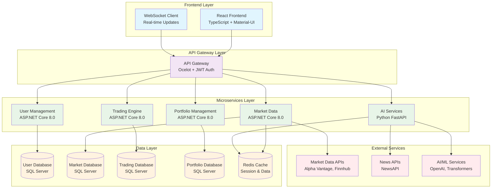
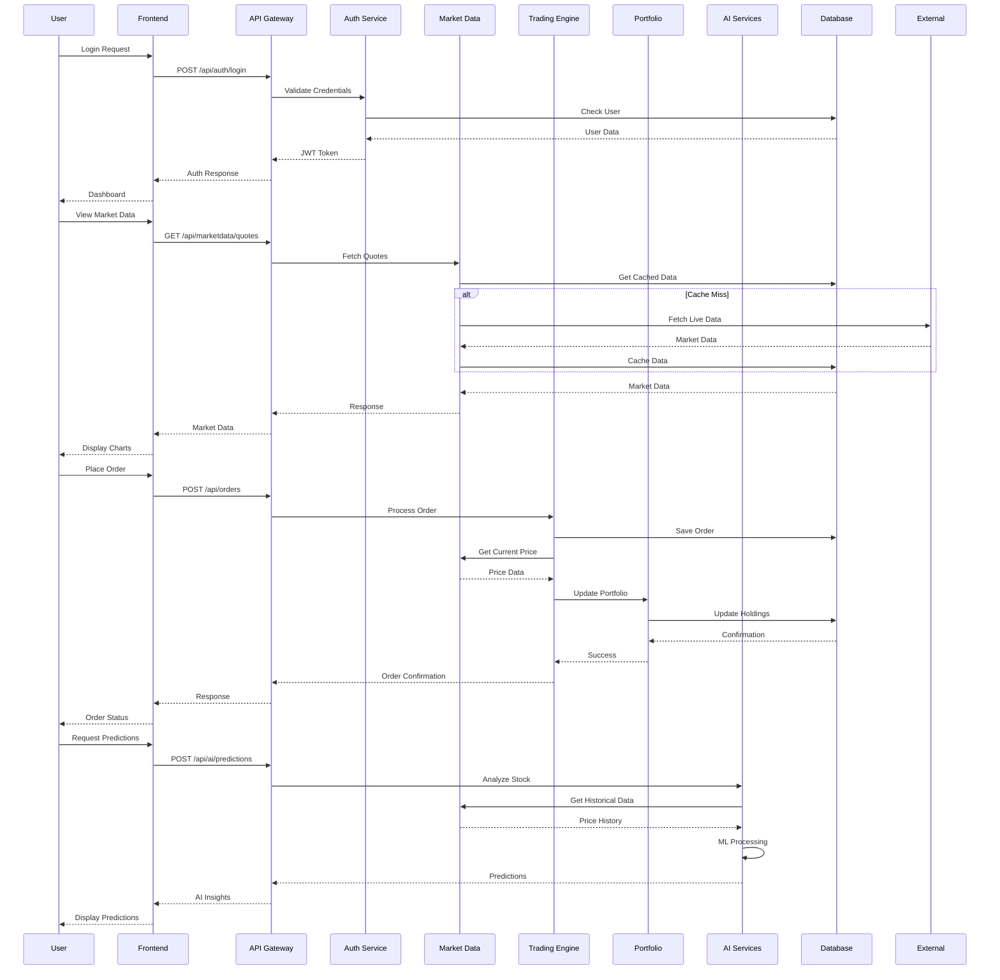
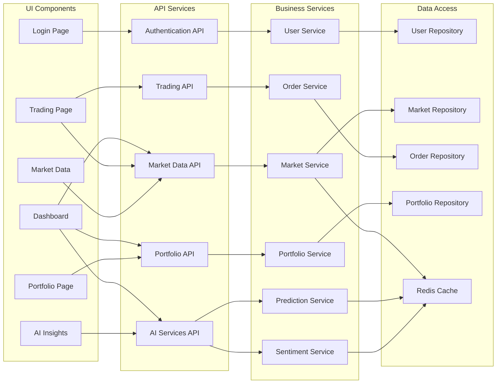
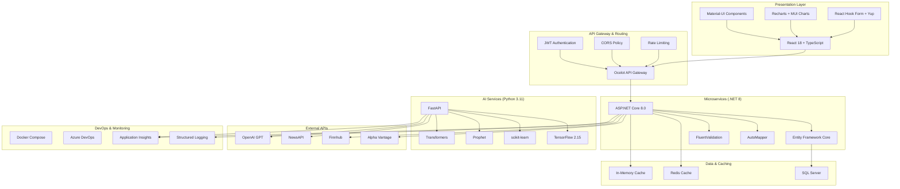

# Stock Trading Platform - Architecture Diagrams

## System Architecture Diagram

```mermaid
graph TB
    %% Frontend Layer
    subgraph "Frontend Layer"
        UI[React Frontend<br/>TypeScript + Material-UI]
        WS[WebSocket Client<br/>Real-time Updates]
    end

    %% API Gateway
    subgraph "API Gateway Layer"
        GW[API Gateway<br/>Ocelot + JWT Auth]
    end

    %% Microservices Layer
    subgraph "Microservices Layer"
        UM[User Management<br/>ASP.NET Core 8.0]
        MD[Market Data<br/>ASP.NET Core 8.0]
        TE[Trading Engine<br/>ASP.NET Core 8.0]
        PM[Portfolio Management<br/>ASP.NET Core 8.0]
        AI[AI Services<br/>Python FastAPI]
    end

    %% Data Layer
    subgraph "Data Layer"
        DB1[(User Database<br/>SQL Server)]
        DB2[(Market Database<br/>SQL Server)]
        DB3[(Trading Database<br/>SQL Server)]
        DB4[(Portfolio Database<br/>SQL Server)]
        REDIS[(Redis Cache<br/>Session & Data)]
    end

    %% External Services
    subgraph "External Services"
        EXT1[Market Data APIs<br/>Alpha Vantage, Finnhub]
        EXT2[News APIs<br/>NewsAPI]
        EXT3[AI/ML Services<br/>OpenAI, Transformers]
    end

    %% Connections
    UI --> GW
    WS --> GW
    GW --> UM
    GW --> MD
    GW --> TE
    GW --> PM
    GW --> AI

    UM --> DB1
    MD --> DB2
    TE --> DB3
    PM --> DB4

    MD --> REDIS
    AI --> REDIS

    MD --> EXT1
    AI --> EXT2
    AI --> EXT3

    %% Styling
    classDef frontend fill:#e1f5fe
    classDef gateway fill:#f3e5f5
    classDef microservice fill:#e8f5e8
    classDef data fill:#fff3e0
    classDef external fill:#ffebee

    class UI,WS frontend
    class GW gateway
    class UM,MD,TE,PM,AI microservice
    class DB1,DB2,DB3,DB4,REDIS data
    class EXT1,EXT2,EXT3 external
```

## Data Flow Diagram

```mermaid
sequenceDiagram
    participant U as User
    participant F as Frontend
    participant G as API Gateway
    participant A as Auth Service
    participant M as Market Data
    participant T as Trading Engine
    participant P as Portfolio
    participant AI as AI Services
    participant D as Database

    %% Authentication Flow
    U->>F: Login Request
    F->>G: POST /api/auth/login
    G->>A: Validate Credentials
    A->>D: Check User
    D-->>A: User Data
    A-->>G: JWT Token
    G-->>F: Auth Response
    F-->>U: Dashboard

    %% Market Data Flow
    U->>F: View Market Data
    F->>G: GET /api/marketdata/quotes
    G->>M: Fetch Quotes
    M->>D: Get Cached Data
    alt Cache Miss
        M->>External: Fetch Live Data
        External-->>M: Market Data
        M->>D: Cache Data
    end
    D-->>M: Market Data
    M-->>G: Response
    G-->>F: Market Data
    F-->>U: Display Charts

    %% Trading Flow
    U->>F: Place Order
    F->>G: POST /api/orders
    G->>T: Process Order
    T->>D: Save Order
    T->>M: Get Current Price
    M-->>T: Price Data
    T->>P: Update Portfolio
    P->>D: Update Holdings
    D-->>P: Confirmation
    P-->>T: Success
    T-->>G: Order Confirmation
    G-->>F: Response
    F-->>U: Order Status

    %% AI Insights Flow
    U->>F: Request Predictions
    F->>G: POST /api/ai/predictions
    G->>AI: Analyze Stock
    AI->>M: Get Historical Data
    M-->>AI: Price History
    AI->>AI: ML Processing
    AI-->>G: Predictions
    G-->>F: AI Insights
    F-->>U: Display Predictions
```

## Component Interaction Diagram

```mermaid
graph LR
    %% User Interface Components
    subgraph "UI Components"
        LOGIN[Login Page]
        DASH[Dashboard]
        TRADE[Trading Page]
        PORT[Portfolio Page]
        MARKET[Market Data]
        INSIGHTS[AI Insights]
    end

    %% API Services
    subgraph "API Services"
        AUTH_API[Authentication API]
        MARKET_API[Market Data API]
        TRADE_API[Trading API]
        PORT_API[Portfolio API]
        AI_API[AI Services API]
    end

    %% Business Logic
    subgraph "Business Services"
        USER_SVC[User Service]
        MARKET_SVC[Market Service]
        ORDER_SVC[Order Service]
        PORTFOLIO_SVC[Portfolio Service]
        PREDICT_SVC[Prediction Service]
        SENTIMENT_SVC[Sentiment Service]
    end

    %% Data Access
    subgraph "Data Access"
        USER_REPO[User Repository]
        MARKET_REPO[Market Repository]
        ORDER_REPO[Order Repository]
        PORT_REPO[Portfolio Repository]
        CACHE[Redis Cache]
    end

    %% Connections
    LOGIN --> AUTH_API
    DASH --> MARKET_API
    DASH --> PORT_API
    DASH --> AI_API
    TRADE --> TRADE_API
    TRADE --> MARKET_API
    PORT --> PORT_API
    MARKET --> MARKET_API
    INSIGHTS --> AI_API

    AUTH_API --> USER_SVC
    MARKET_API --> MARKET_SVC
    TRADE_API --> ORDER_SVC
    PORT_API --> PORTFOLIO_SVC
    AI_API --> PREDICT_SVC
    AI_API --> SENTIMENT_SVC

    USER_SVC --> USER_REPO
    MARKET_SVC --> MARKET_REPO
    MARKET_SVC --> CACHE
    ORDER_SVC --> ORDER_REPO
    PORTFOLIO_SVC --> PORT_REPO
    PREDICT_SVC --> CACHE
    SENTIMENT_SVC --> CACHE
```

## Technology Stack Diagram

```mermaid
graph TB
    %% Presentation Layer
    subgraph "Presentation Layer"
        REACT[React 18 + TypeScript]
        MUI[Material-UI Components]
        CHARTS[Recharts + MUI Charts]
        FORMS[React Hook Form + Yup]
    end

    %% API Layer
    subgraph "API Gateway & Routing"
        OCELOT[Ocelot API Gateway]
        JWT[JWT Authentication]
        CORS[CORS Policy]
        RATE[Rate Limiting]
    end

    %% Business Layer
    subgraph "Microservices (.NET 8)"
        ASPNET[ASP.NET Core 8.0]
        EF[Entity Framework Core]
        AUTOMAPPER[AutoMapper]
        FLUENT[FluentValidation]
    end

    %% AI/ML Layer
    subgraph "AI Services (Python 3.11)"
        FASTAPI[FastAPI]
        TENSORFLOW[TensorFlow 2.15]
        SKLEARN[scikit-learn]
        PROPHET[Prophet]
        TRANSFORMERS[Transformers]
    end

    %% Data Layer
    subgraph "Data & Caching"
        SQLSERVER[SQL Server]
        REDIS_CACHE[Redis Cache]
        INMEMORY[In-Memory Cache]
    end

    %% External Integration
    subgraph "External APIs"
        ALPHA[Alpha Vantage]
        FINNHUB[Finnhub]
        NEWS[NewsAPI]
        OPENAI[OpenAI GPT]
    end

    %% DevOps & Monitoring
    subgraph "DevOps & Monitoring"
        DOCKER[Docker Compose]
        AZURE[Azure DevOps]
        INSIGHTS[Application Insights]
        LOGGING[Structured Logging]
    end

    %% Connections
    REACT --> OCELOT
    MUI --> REACT
    CHARTS --> REACT
    FORMS --> REACT

    OCELOT --> ASPNET
    JWT --> OCELOT
    CORS --> OCELOT
    RATE --> OCELOT

    ASPNET --> EF
    ASPNET --> AUTOMAPPER
    ASPNET --> FLUENT

    FASTAPI --> TENSORFLOW
    FASTAPI --> SKLEARN
    FASTAPI --> PROPHET
    FASTAPI --> TRANSFORMERS

    EF --> SQLSERVER
    ASPNET --> REDIS_CACHE
    ASPNET --> INMEMORY

    ASPNET --> ALPHA
    ASPNET --> FINNHUB
    FASTAPI --> NEWS
    FASTAPI --> OPENAI

    ASPNET --> INSIGHTS
    FASTAPI --> INSIGHTS
    ASPNET --> LOGGING
```
